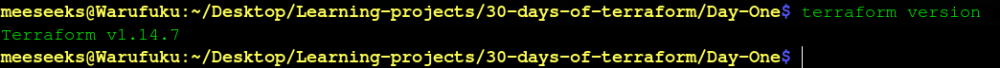
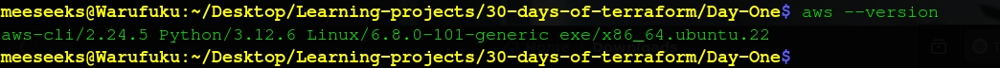
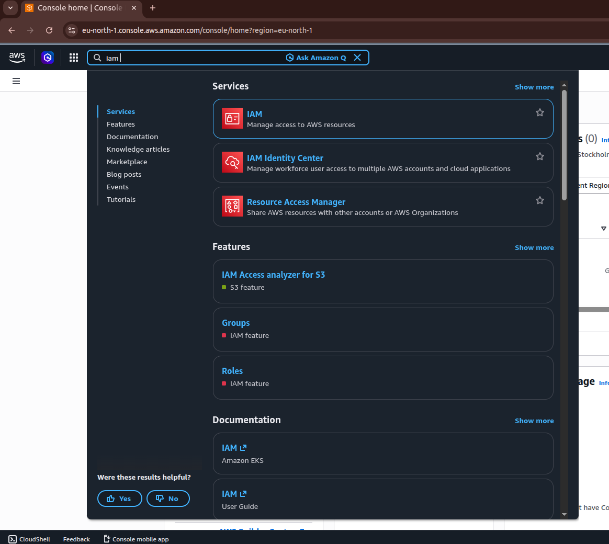
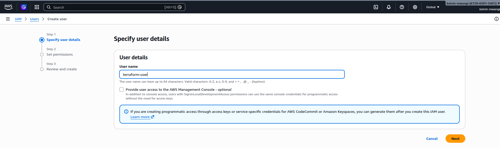
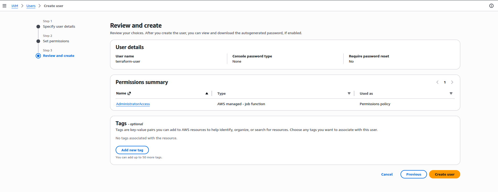
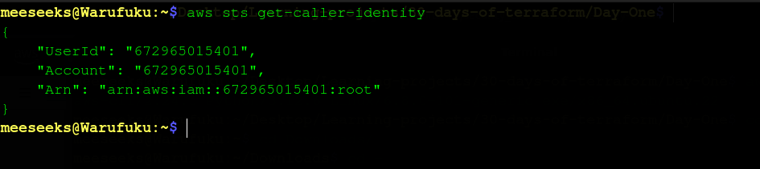

# DAY ONE: INTRODUCTION TO TERRAFORM AND INFRASTRUCTURE AS CODE


## Prerequisites

Before starting the Terraform challenge, the following were required:

- Basic understanding of Linux terminal commands
- AWS account with IAM access
- Internet connection for installing tools and accessing cloud services
- Visual Studio Code (or any code editor)

## PREPARING THE ENVIRONMENT

### Step 1: Install Terraform
Terraform was installed using the official HashiCorp repository.

#### Installation Steps

```bash
  sudo apt update
  sudo apt install -y gnupg software-properties-common

  wget -O- https://apt.releases.hashicorp.com/gpg | \
  gpg --dearmor | \
  sudo tee /usr/share/keyrings/hashicorp-archive-keyring.gpg

  echo "deb [signed-by=/usr/share/keyrings/hashicorp-archive-keyring.gpg] \
  https://apt.releases.hashicorp.com $(lsb_release -cs) main" | \
  sudo tee /etc/apt/sources.list.d/hashicorp.list

  sudo apt update
  sudo apt install terraform
```

Verification
```bash 
  terraform version
```

Output 
```bash
  Terraform v1.14.7
  on linux_amd64
```

_**NOTE**: This confirms Terraform is installed and available in the system PATH._




### 2. Install AWS CLI

The AWS CLI was installed to allow interaction with AWS services from the terminal.

#### Installation Steps

```bash
  sudo apt update
  sudo apt install awscli -y
```

Verification

```bash 
  aws --version
```

Output
```bash
  aws-cli/2.24.5 Python/3.12.6 Linux/6.8.0-101-generic exe/x86_64.ubuntu.22
```

_**NOTE**: This confirms that the AWS CLI is successfully installed and ready for configuration._



### 3. Configure AWS CLI

Before configuring the AWS CLI, an IAM user was created from the AWS Console.

#### IAM Setup

Steps followed:

- Searched for **IAM** in AWS Console

  

- Created a new user: `terraform-user`

  

- Assigned permissions (AdministratorAccess for this setup)



- Generated Access Key and Secret Key


#### Configure AWS CLI

```bash
  aws configure
```

Entered:
```bash
  AWS Access Key ID: **************
  AWS Secret Access Key: **************
  Default region name: eu-west-1
  Default output format: json
```

Verification

```bash
  aws sts get-caller-identity
```

Output
```json
  {
    "UserId": "672965015401",
    "Account": "672965015401",
    "Arn": "arn:aws:iam::672965015401:root"
  }
```

_**NOTE**: This confirms that the AWS CLI is successfully authenticated and can communicate with AWS services._



### 4. Install VS Code Extensions

To improve development workflow and productivity, Visual Studio Code extensions were installed.

#### Extensions Installed

- **HashiCorp Terraform** — provides syntax highlighting, autocomplete, and validation for Terraform files  
- **AWS Toolkit** — enables interaction with AWS services directly from VS Code  

#### Steps

- Opened Extensions tab in VS Code  
- Searched for **Terraform** and installed the HashiCorp extension  


- Searched for **AWS Toolkit** and installed it  


_**NOTE**: These extensions make it easier to write, manage, and validate Terraform configurations, and integrate AWS workflows directly into the editor._

## Key Takeaways

After reading Chapter 1 of _`Terraform: Up & Running` by Yevgeniy Brikman_, I gained an understanding of why Infrastructure as Code is important and how Terraform fits into modern DevOps workflows.

A more detailed breakdown of what I learned is shared in my blog post below.

## Blog Post

[Read here](https://medium.com/@mwangi8kevin/what-is-infrastructure-as-code-and-why-its-transforming-devops-447ab0f62df6)

## Conclusion

Day 1 focused on building the foundation by setting up the environment and understanding the role of Infrastructure as Code in modern systems.

With Terraform and AWS fully configured, the next step is to start writing Terraform code and provisioning infrastructure.

**SEE YOU ON DAY 2. TIME TO START BUILDING!**

