# DAY THREE: DEPLOYING YOUR FIRST SERVER WITH TERRAFORM

<div style="text-align: center;">
  
</div>


## Project Setup

A new project directory was created to hold the Terraform configuration.

```bash
  mkdir Day-Three
  cd Day-Three
  code main.tf
```

## Architecture Diagram

The diagram below represents the final deployed architecture:

- Internet traffic enters via HTTP (port 80)
- Security group allows HTTP (80) and SSH (22)
- EC2 instance runs Ubuntu and Nginx
- Hosted in AWS (eu-north-1 region)

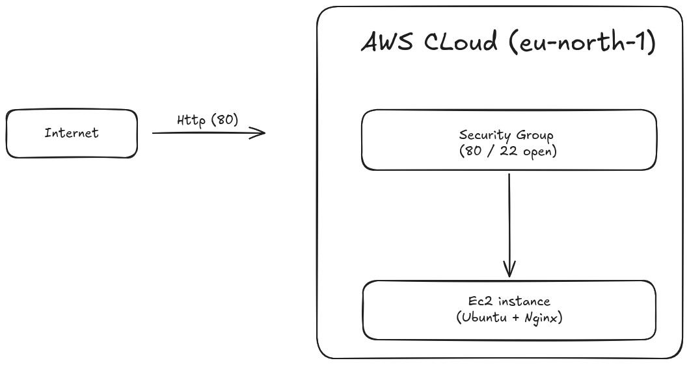

## Provider Block

The provider block defines which cloud provider Terraform will use and the region where resources will be created.

```hcl
provider "aws" {
  region = "eu-north-1"
}
```

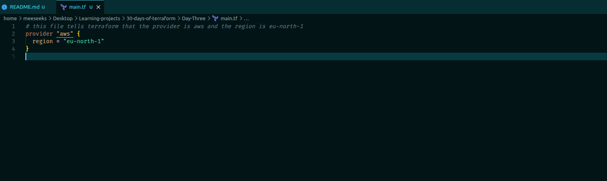

***NOTE**: This tells Terraform to use AWS and deploy resources in the specified region.*

## Resource Block

A resource block was added to define the infrastructure to be created.

```hcl
resource "aws_instance" "web" {
  ami           = "ami-0c94855ba95c71c99"
  instance_type = "t3.micro"
}
```

***NOTE**: This defines an EC2 instance to be created in AWS. The AMI specifies the operating system image, and the instance type defines the size of the server.*

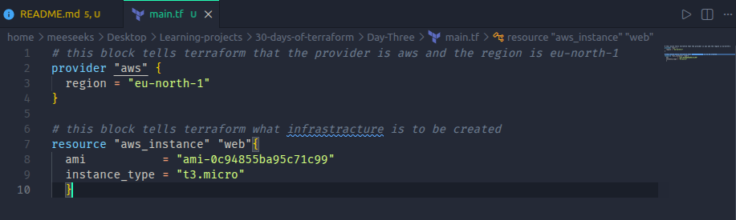

## Terraform Initialization

After defining the provider and resource blocks, Terraform was initialized to prepare the working directory and download required providers.

```bash
  terraform init
```

### Expected Output

```bash
  Initializing the backend...

  Initializing provider plugins...
  - Finding latest version of hashicorp/aws...
  - Installing hashicorp/aws v6.37.0...
  - Installed hashicorp/aws v6.37.0 (signed by HashiCorp)

  Terraform has created a lock file .terraform.lock.hcl

  Terraform has been successfully initialized!
```

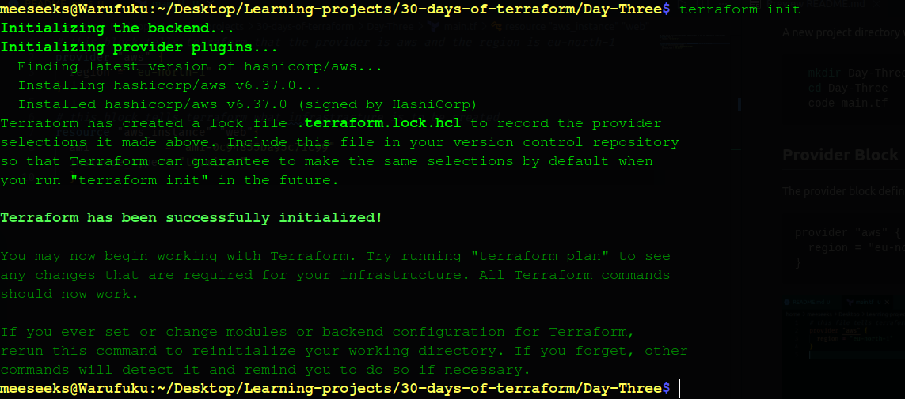

### Explanation

This step prepares Terraform to run by downloading the AWS provider plugin and creating a lock file to ensure consistent versions across runs. It also sets up the working directory so Terraform can manage infrastructure correctly.

## Terraform Plan

After initializing Terraform, the next step was to preview the infrastructure changes before applying them.

```bash
  terraform plan
```


### Output (Summary)

```bash
  Plan: 1 to add, 0 to change, 0 to destroy.
```

### Explanation

This step shows what Terraform is about to create without actually provisioning anything.

The plan confirms that:

- One EC2 instance (`aws_instance.web`) will be created
- No existing infrastructure will be modified or destroyed

Most values are marked as:

```
(known after apply)
```

This means Terraform will only know those values after the resource is created. For example:

- public IP
- instance ID
- DNS name

This step is critical because it acts as a safety check before making real changes to cloud infrastructure.

## Deployment Attempt and Fix

After running the plan successfully, the next step was to apply the configuration:

```bash
  terraform apply
````

Terraform prompted for confirmation, and I entered:

```bash
  yes
```

### First Attempt (Failed)

The deployment failed with the following error:

```bash
  InvalidAMIID.NotFound: The image id does not exist
```

***NOTE**: This happened because the AMI used was not available in the selected region (`eu-north-1`).*

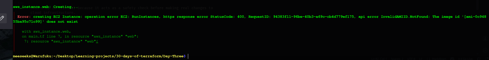

### Fix

To resolve this, I navigated to the AWS AMI catalog and selected a valid Amazon Linux 2023 AMI for the `eu-north-1` region.

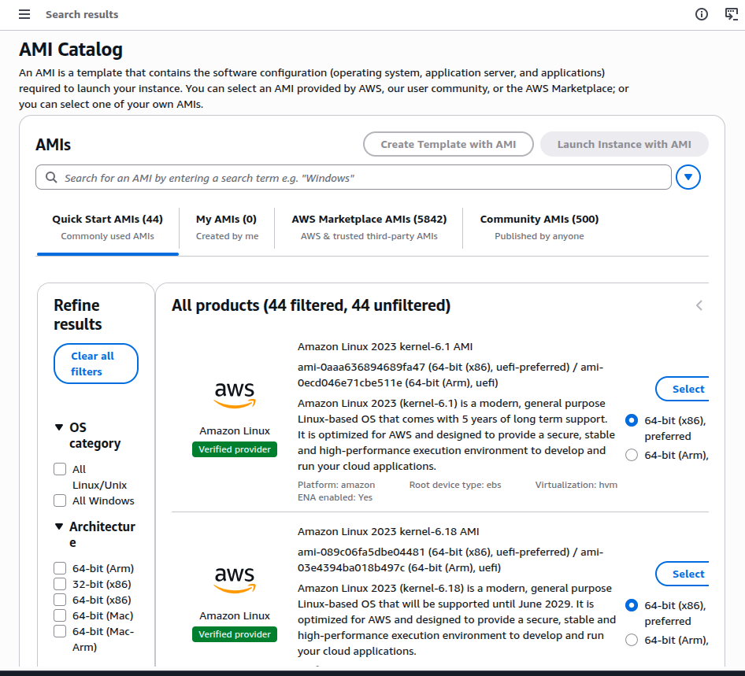

Updated configuration:

```hcl
  ami = "ami-0aaa636894689fa47"
```

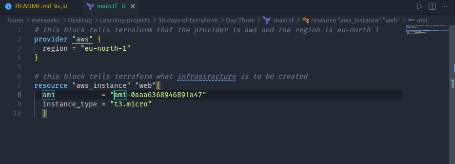

### Second Attempt (Successful)

After updating the AMI, I ran:

```bash
  terraform apply
```

Confirmed again with:

```bash
  yes
```

Terraform successfully created the EC2 instance:

```bash
 Apply complete! Resources: 1 added, 0 changed, 0 destroyed.
```

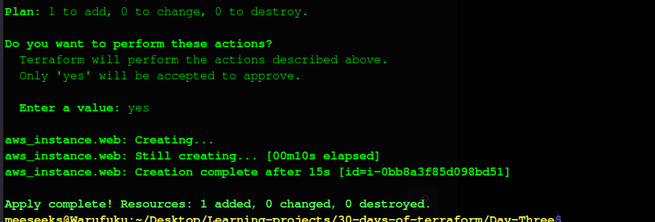

### Key Learning

AMI IDs are region-specific. Using the wrong AMI for a region will cause deployment to fail. Always verify the AMI in the AWS region you are working in.

---

## MAKING THE SERVER ACCESSIBLE

Although the EC2 instance was successfully created, it was not accessible via the browser.

When attempting to access the public IP, the request timed out:

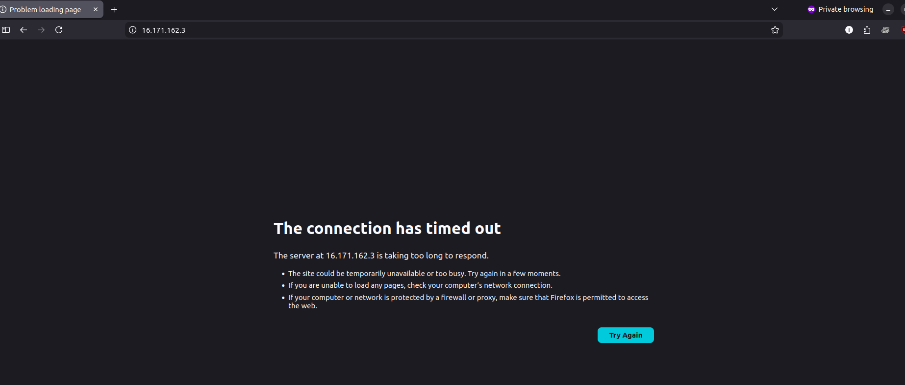

At the same time, running:

```bash
terraform output
```

returned:

```bash
Warning: No outputs found
```

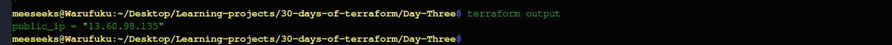

This indicated two issues:

- The instance existed but was not reachable over the network
- The Terraform configuration was missing an output definition

### Identifying the Problem

The root causes were:

- No **HTTP (port 80)** access configured in the security group
- No **SSH (port 22)** access for debugging
- No **output block** to retrieve the public IP
- The server had **no web server installed**, so even if reachable, nothing would respond

### Fix: Updating Security and Server Configuration

To resolve this:

- A **security group** was added to allow:

  - HTTP (port 80)
  - SSH (port 22)
- A **user_data script** was introduced to install and start a web server
- An **output block** was added to expose the public IP

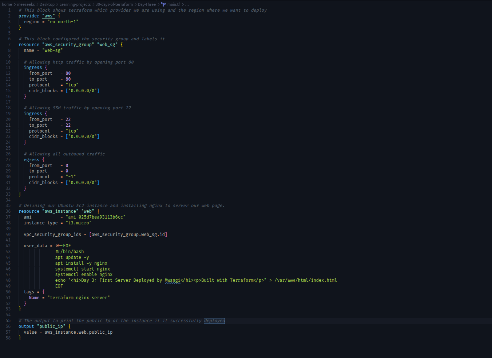

***NOTE**: Port 80 allows browser access, while port 22 allows SSH for troubleshooting.*

### Switching to Ubuntu and Nginx

To simplify provisioning and avoid OS inconsistencies:

- Switched to **Ubuntu 22.04 LTS**
- Replaced Apache with **Nginx**
- Updated provisioning commands to use `apt`

### Updating the Instance (Terraform Apply)

After making these changes:

```bash
terraform apply
```

Confirmed with:

```bash
yes
```

Terraform updated the existing instance:

```bash
Apply complete! Resources: 0 added, 1 changed, 0 destroyed.
```

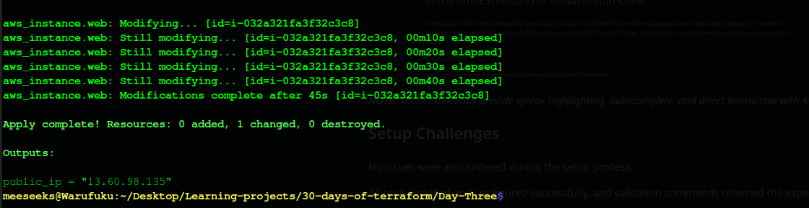

### Verifying the Fix

The public IP was retrieved successfully:

```bash
terraform output
```

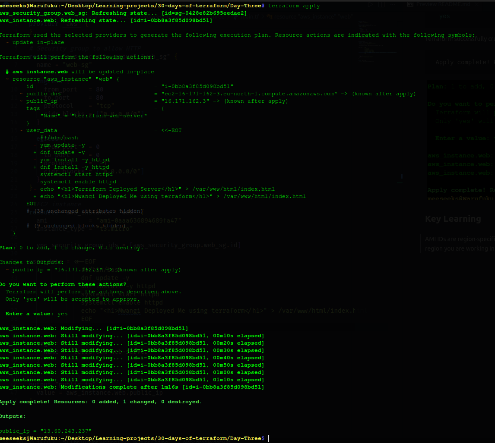

The IP was opened in the browser:

```
http://<public_ip>
```

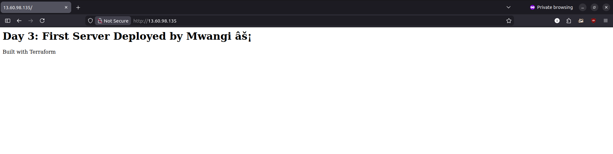


### Result

The server successfully responded with the deployed page:

- Nginx was running
- The HTML content from `user_data` was served correctly
- The infrastructure was now fully accessible over the internet

## Final Terraform Configuration

```hcl
provider "aws" {
  region = "eu-north-1"
}

resource "aws_security_group" "web_sg" {
  name = "web-sg"

  ingress {
    from_port   = 80
    to_port     = 80
    protocol    = "tcp"
    cidr_blocks = ["0.0.0.0/0"]
  }

  ingress {
    from_port   = 22
    to_port     = 22
    protocol    = "tcp"
    cidr_blocks = ["0.0.0.0/0"]
  }

  egress {
    from_port   = 0
    to_port     = 0
    protocol    = "-1"
    cidr_blocks = ["0.0.0.0/0"]
  }
}

resource "aws_instance" "web" {
  ami           = "ami-025d7bea93113b6cc"
  instance_type = "t3.micro"

  vpc_security_group_ids = [aws_security_group.web_sg.id]

  user_data = <<-EOF
              #!/bin/bash
              apt update -y
              apt install -y nginx
              systemctl start nginx
              systemctl enable nginx
              echo "<h1>Day 3: First Server Deployed by Mwangi ⚡</h1><p>Built with Terraform</p>" > /var/www/html/index.html
              EOF

  tags = {
    Name = "terraform-nginx-server"
  }
}

output "public_ip" {
  value = aws_instance.web.public_ip
}
```

### Key Learning

Provisioning infrastructure is only one part of the process. Making services accessible requires:

- Proper network configuration (security groups)
- Correct OS-level setup (web server installation)
- Choosing the right base image to reduce complexity

This was the first complete end-to-end deployment using Terraform.

## Cleaning Up Resources

After confirming the server was working, the infrastructure was destroyed to avoid unnecessary cloud costs.

```bash
  terraform destroy
```

Terraform displayed the resources to be removed:

```
Plan: 0 to add, 0 to change, 2 to destroy.
```

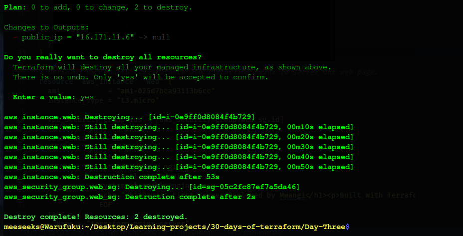

After confirmation:

```
yes
```

Terraform removed all resources:

```
  Destroy complete! Resources: 2 destroyed.
```

Verification

```bash
  terraform state list
```

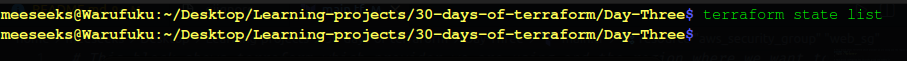

```bash
  terraform output
```

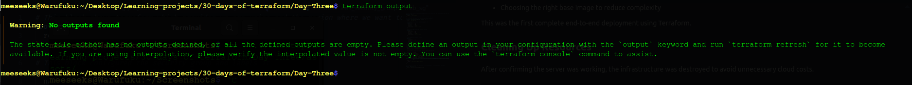

Returned no resources, confirming that all infrastructure had been successfully deleted.

### Key Learning

Terraform not only provisions infrastructure but also cleanly removes it, ensuring no unused resources continue running and incurring costs.
