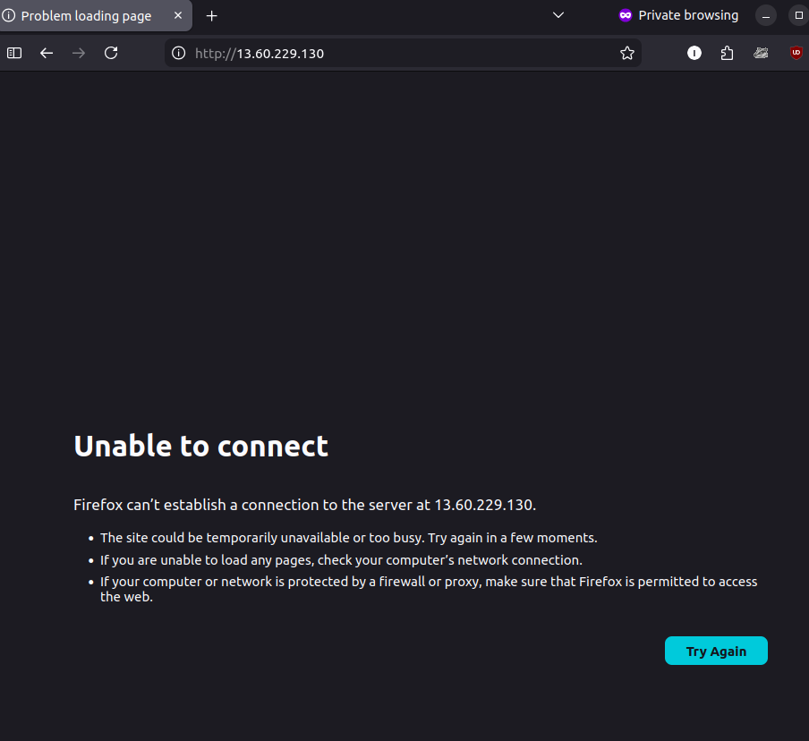

# MASTERING BASIC INFRASTRUCTURE WITH TERRAFORM


## Tasks checklist

- [ ] Read pages 60–69 of Chapter 2
- [ ] Complete Lab 1: Intro to the Terraform Data Block
- [ ] Complete Lab 2: Intro to Input Variables
- [ ] Deploy a configurable web server
- [ ] Deploy a clustered web server
- [ ] Explore Terraform documentation
- [ ] Write blog post
- [ ] Post on social media

### Configure AWS provider

I configured the AWS provider in the main.tf file by specifying the region.

```hcl
provider "aws" {
  region = "eu-north-1"
}
```

Then I initialized Terraform using:

```bash  
 terraform init
```

Outcome:
Terraform successfully initialized the working directory.
The AWS provider plugin was downloaded and a .terraform.lock.hcl file was created to lock provider versions.


### Add a data source

I added a data block to fetch the latest Amazon Linux AMI dynamically instead of hardcoding an AMI ID.

```hcl
data "aws_ami" "amazon_linux" {
  most_recent = true

  owners = ["amazon"]

  filter {
    name   = "name"
    values = ["amzn2-ami-hvm-*-x86_64-gp2"]
  }
}
```

Error:

When I ran terraform plan, I got:

Duplicate provider configuration

Cause:

Terraform was reading multiple .tf files and found more than one AWS provider block.

Fix:

I removed the duplicate provider configuration from the extra file (main_local.tf).

```bash  
  rm main_local.tf
```

Outcome:

Terraform plan runs successfully and recognizes the data source correctly.


### Use data source in EC2

I updated the EC2 instance to use a dynamic AMI instead of a hardcoded value.

```hcl
  ami = data.aws_ami.amazon_linux.id
```

Then I validated and planned the infrastructure using:

```bash  
  terraform validate
  terraform plan
```


### Introduce input variable

I created an input variable to make the EC2 instance type configurable.

```hcl
  variable "instance_type" {
    description = "EC2 instance type"
    type        = string
    default     = "t3.micro"
  }
```

Then I updated the EC2 resource to use the variable:

```hcl
 instance_type = var.instance_type
```

I validated and planned the configuration:

```bash
 terraform validate
 terraform plan
```


Outcome:

- Terraform configuration is valid
- Instance type is now configurable instead of hardcoded
- Default value t3.micro is used in the plan


### Add variable for server name

I created a variable to make the EC2 instance name configurable.

```hcl
variable "server_name" {
  description = "Name of the EC2 instance"
  type        = string
  default     = "terraform-nginx-server"
}
```

Then I updated the EC2 resource to use the variable:

tags = {
  Name = var.server_name
}

I validated and planned the cofiguration

```bash
  terraform validate
  terraform plan
```


Outcome:

- Terraform configuration is valid
- Instance name is now configurable
- Default value is applied in the plan

### Override variable at runtime

I tested overriding the default variable value directly from the command line.

```bash
  terraform plan -var="instance_type=t3.small"
```


Outcome:

- Terraform used the overridden value instead of the default
- Instance type changed from t3.micro to t3.small in the plan
- This confirms variables can be controlled dynamically at runtime


### Add output for public IP

I created an output variable to expose the public IP address of the EC2 instance after deployment.

```hcl
output "public_ip" {
  description = "Public IP of the EC2 instance"
  value       = aws_instance.web.public_ip
}
```

```bash
  terraform validate
  terraform plan
```


Outcome:

- Terraform configuration is valid
- The output is recognized by Terraform
- Plan shows the public IP will be available after apply:

`public_ip = (known after apply)`


### Deploy the infrastructure

I deployed the infrastructure using Terraform.

```bash
  terraform apply
```

I confirmed the execution by typing:

```bash
 yes
```


Outcome:

- Security group was created
- EC2 instance was successfully provisioned
- Terraform reported:

Apply complete! Resources: 2 added, 0 changed, 0 destroyed.

- The public IP of the instance was generated:

`public_ip = "16.170.235.119"`

### Fix deployment and verify web server

After deployment, the web server was not accessible in the browser.

Error:

The browser returned:

Unable to connect



Cause:

- The initial configuration used Amazon Linux but installed packages using `apt`
- `user_data` failed silently
- Terraform does not re-run `user_data` on existing instances

Fix:

1. Switched to Ubuntu AMI using a correct data source:

```hcl
data "aws_ami" "ubuntu" {
  most_recent = true

  owners = ["099720109477"]

  filter {
    name   = "name"
    values = ["ubuntu/images/hvm-ssd-gp3/ubuntu-noble-24.04-amd64-server-*"]
  }

  filter {
    name   = "virtualization-type"
    values = ["hvm"]
  }
}
```


Updated EC2 to use Ubuntu:

```hcl
 ami = data.aws_ami.ubuntu.id
```

Fixed user_data to use apt:

```bash 
  apt update -y
  apt install -y nginx
```

Forced instance recreation:

```bash
  terraform apply -replace="aws_instance.web"
```


Outcome:

- Instance recreated successfully
- Nginx installed and running
- Web server accessible via browser
- Custom HTML page displayed correctly


### Clean up resources

After verifying the deployment, I destroyed all provisioned infrastructure to avoid unnecessary cloud costs.

```bash
terraform destroy
```

I confirmed the action by typing:

```bash
  yes
```


Outcome:

- EC2 instance was successfully terminated
- Security group was deleted
- Terraform reported:

Destroy complete! Resources: 2 destroyed.

- No resources remain running in AWS

## Key Takeaways

Data sources allow Terraform to fetch dynamic values such as the latest AMI instead of relying on hardcoded configurations. Variables make infrastructure more reusable and flexible by enabling customization without modifying the core code.

One key behavior observed is that Terraform does not re-run user_data on existing resources, which means changes often require resource recreation.

AMI availability varies by region, so configurations must account for regional differences. It is important to destroy resources after testing to avoid unnecessary cloud costs.