# MASTERING BASIC INFRASTRUCTURE WITH TERRAFORM


## Tasks checklist

- [ ] Read pages 60–69 of Chapter 2
- [ ] Complete Lab 1: Intro to the Terraform Data Block
- [ ] Complete Lab 2: Intro to Input Variables
- [ ] Deploy a configurable web server
- [ ] Deploy a clustered web server
- [ ] Explore Terraform documentation
- [ ] Write blog post
- [ ] Post on social media

## PART ONE  

### Configure AWS provider

I configured the AWS provider in the main.tf file by specifying the region.

```hcl
provider "aws" {
  region = "eu-north-1"
}
```

Then I initialized Terraform using:

```bash  
 terraform init
```

Outcome:
Terraform successfully initialized the working directory.
The AWS provider plugin was downloaded and a .terraform.lock.hcl file was created to lock provider versions.

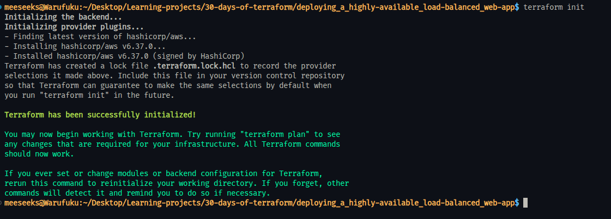

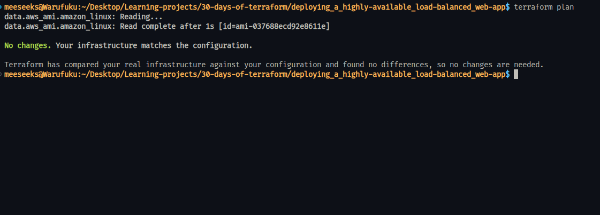

### Add a data source

I added a data block to fetch the latest Amazon Linux AMI dynamically instead of hardcoding an AMI ID.

```hcl
data "aws_ami" "amazon_linux" {
  most_recent = true

  owners = ["amazon"]

  filter {
    name   = "name"
    values = ["amzn2-ami-hvm-*-x86_64-gp2"]
  }
}
```

Error:

When I ran terraform plan, I got:

Duplicate provider configuration

Cause:

Terraform was reading multiple .tf files and found more than one AWS provider block.

Fix:

I removed the duplicate provider configuration from the extra file (main_local.tf).

```bash  
  rm main_local.tf
```

Outcome:

Terraform plan runs successfully and recognizes the data source correctly.
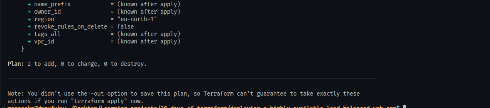

### Use data source in EC2

I updated the EC2 instance to use a dynamic AMI instead of a hardcoded value.

```hcl
  ami = data.aws_ami.amazon_linux.id
```

Then I validated and planned the infrastructure using:

```bash  
  terraform validate
  terraform plan
```

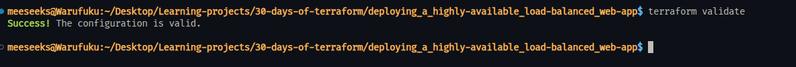

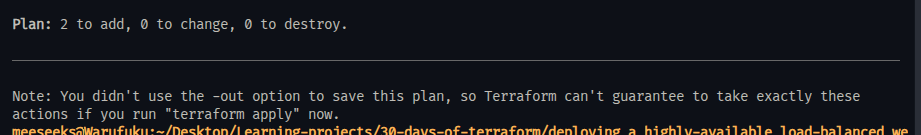


### Introduce input variable

I created an input variable to make the EC2 instance type configurable.

```hcl
  variable "instance_type" {
    description = "EC2 instance type"
    type        = string
    default     = "t3.micro"
  }
```

Then I updated the EC2 resource to use the variable:

```hcl
 instance_type = var.instance_type
```

I validated and planned the configuration:

```bash
 terraform validate
 terraform plan
```

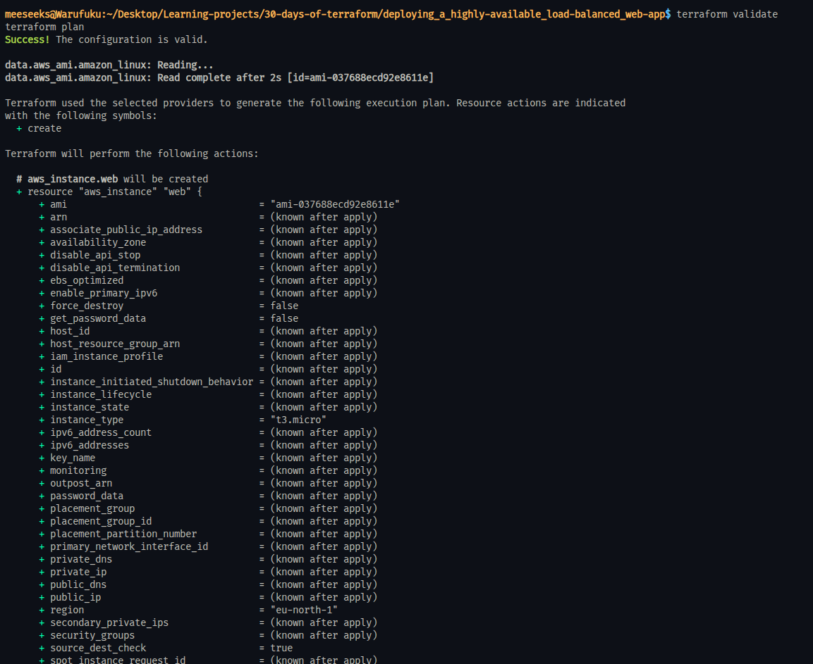

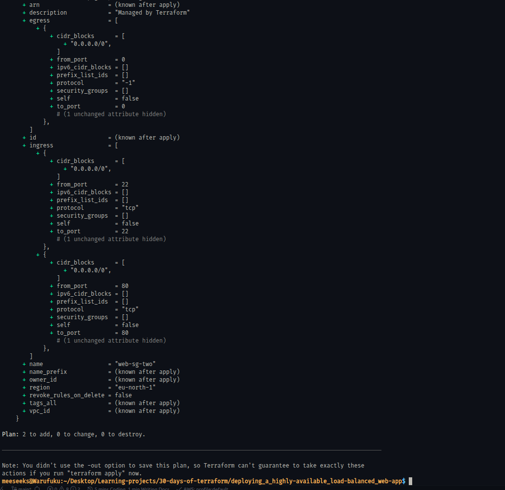


Outcome:

- Terraform configuration is valid
- Instance type is now configurable instead of hardcoded
- Default value t3.micro is used in the plan


### Add variable for server name

I created a variable to make the EC2 instance name configurable.

```hcl
variable "server_name" {
  description = "Name of the EC2 instance"
  type        = string
  default     = "terraform-nginx-server"
}
```

Then I updated the EC2 resource to use the variable:

tags = {
  Name = var.server_name
}

I validated and planned the cofiguration

```bash
  terraform validate
  terraform plan
```


Outcome:

- Terraform configuration is valid
- Instance name is now configurable
- Default value is applied in the plan

### Override variable at runtime

I tested overriding the default variable value directly from the command line.

```bash
  terraform plan -var="instance_type=t3.small"
```

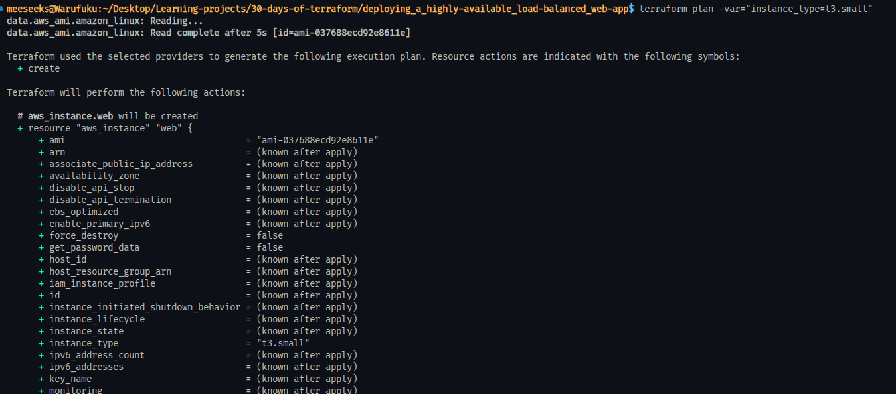


Outcome:

- Terraform used the overridden value instead of the default
- Instance type changed from t3.micro to t3.small in the plan
- This confirms variables can be controlled dynamically at runtime


### Add output for public IP

I created an output variable to expose the public IP address of the EC2 instance after deployment.

```hcl
output "public_ip" {
  description = "Public IP of the EC2 instance"
  value       = aws_instance.web.public_ip
}
```

```bash
  terraform validate
  terraform plan
```

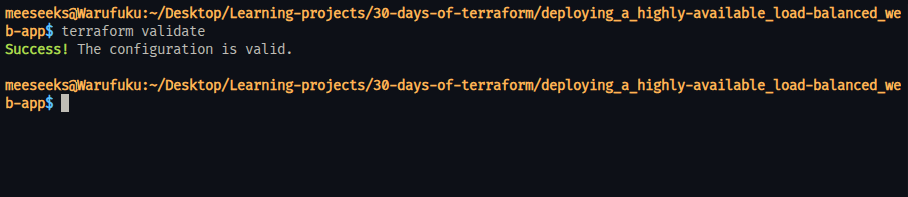
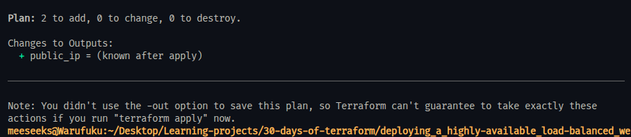


Outcome:

- Terraform configuration is valid
- The output is recognized by Terraform
- Plan shows the public IP will be available after apply:

`public_ip = (known after apply)`


### Deploy the infrastructure

I deployed the infrastructure using Terraform.

```bash
  terraform apply
```

I confirmed the execution by typing:

```bash
 yes
```

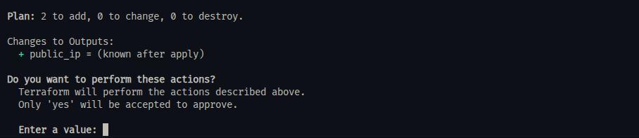

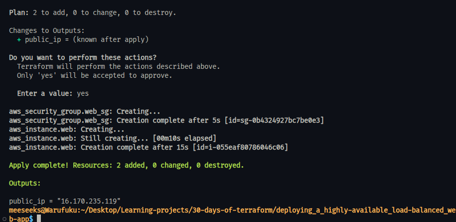

Outcome:

- Security group was created
- EC2 instance was successfully provisioned
- Terraform reported:

Apply complete! Resources: 2 added, 0 changed, 0 destroyed.

- The public IP of the instance was generated:

`public_ip = "16.170.235.119"`

### Fix deployment and verify web server

After deployment, the web server was not accessible in the browser.

Error:

The browser returned:

Unable to connect


Cause:

- The initial configuration used Amazon Linux but installed packages using `apt`
- `user_data` failed silently
- Terraform does not re-run `user_data` on existing instances

Fix:

1. Switched to Ubuntu AMI using a correct data source:

```hcl
data "aws_ami" "ubuntu" {
  most_recent = true

  owners = ["099720109477"]

  filter {
    name   = "name"
    values = ["ubuntu/images/hvm-ssd-gp3/ubuntu-noble-24.04-amd64-server-*"]
  }

  filter {
    name   = "virtualization-type"
    values = ["hvm"]
  }
}
```

Updated EC2 to use Ubuntu:

```hcl
 ami = data.aws_ami.ubuntu.id
```

Fixed user_data to use apt:

```bash  
  apt update -y
  apt install -y nginx
```

Forced instance recreation:

```bash
  terraform apply -replace="aws_instance.web"
```

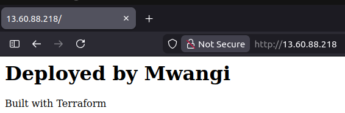

Outcome:

- Instance recreated successfully
- Nginx installed and running
- Web server accessible via browser
- Custom HTML page displayed correctly

### Clean up resources

After verifying the deployment, I destroyed all provisioned infrastructure to avoid unnecessary cloud costs.

```bash
terraform destroy
```

I confirmed the action by typing:

```bash
  yes
```

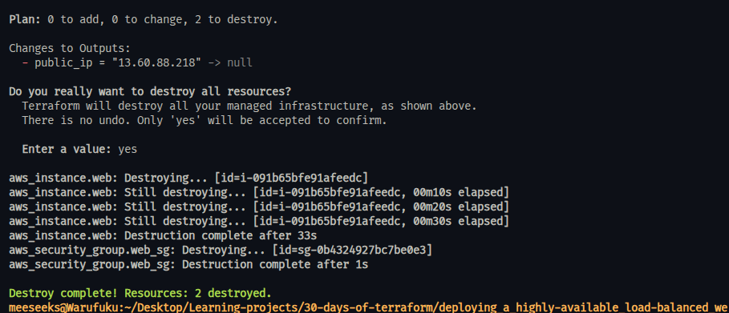

Outcome:

- EC2 instance was successfully terminated
- Security group was deleted
- Terraform reported:

Destroy complete! Resources: 2 destroyed.

- No resources remain running in AWS

## Key Takeaways

Data sources allow Terraform to fetch dynamic values such as the latest AMI instead of relying on hardcoded configurations. Variables make infrastructure more reusable and flexible by enabling customization without modifying the core code.

One key behavior observed is that Terraform does not re-run user_data on existing resources, which means changes often require resource recreation.

AMI availability varies by region, so configurations must account for regional differences. It is important to destroy resources after testing to avoid unnecessary cloud costs.

---

## PART TWO  

### Add availability zones data source

I added a data source to dynamically fetch the available availability zones in the selected AWS region.

```hcl
  data "aws_availability_zones" "available" {}

```


Outcome:

- Terraform configuration is valid
- Availability zones are now dynamically available for use in the Auto Scaling Group
- This removes the need to hardcode zones and improves portability across regions

### Create Launch Template

I replaced the standalone EC2 instance with a Launch Template to support scalable infrastructure.

```hcl
resource "aws_launch_template" "web" {
  name_prefix   = "web-template-"
  image_id      = data.aws_ami.ubuntu.id
  instance_type = var.instance_type

  vpc_security_group_ids = [aws_security_group.web_sg.id]

  user_data = base64encode(<<-EOF
              #!/bin/bash
              apt update -y
              apt install -y nginx
              systemctl start nginx
              systemctl enable nginx
              echo "<h1>Deployed by Mwangi</h1><p>Built with Terraform</p>" > /var/www/html/index.html
              EOF
  )

  tag_specifications {
    resource_type = "instance"

    tags = {
      Name = var.server_name
    }
  }
}
```

During this step, I encountered an error:

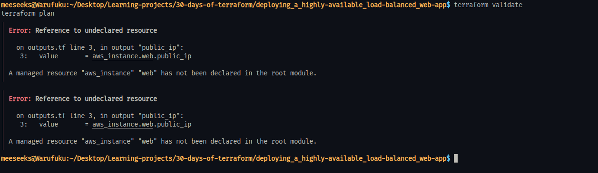

Reference to undeclared resource `aws_instance.web`

Cause:

The previous EC2 instance resource was removed, but the output block was still referencing it.

Fix:

I removed the outdated output from outputs.tf.

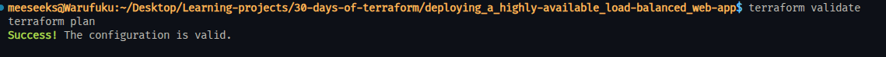

Outcome:

- Terraform configuration is valid
- Launch Template is successfully recognized in the plan
- The architecture is now ready for Auto Scaling instead of a single instance

### Create Auto Scaling Group

I created an Auto Scaling Group (ASG) to deploy multiple EC2 instances using the Launch Template.

```hcl
resource "aws_autoscaling_group" "web" {
  name                = "web-asg"
  min_size            = 2
  max_size            = 5
  desired_capacity    = 2
  vpc_zone_identifier = data.aws_subnets.default.ids

  launch_template {
    id      = aws_launch_template.web.id
    version = "$Latest"
  }

  tag {
    key                 = "Name"
    value               = var.server_name
    propagate_at_launch = true
  }
}
```

I validated and planned the configuration:

```bash
  terraform validate
  terraform plan
```


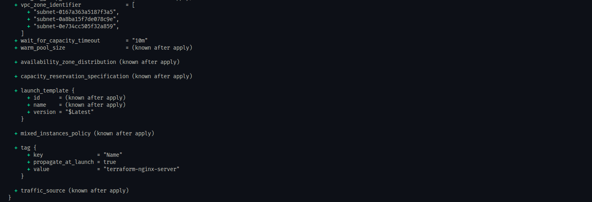

Outcome:

- Terraform configuration is valid
- Auto Scaling Group is correctly configured
- Multiple EC2 instances can now be created dynamically
- Infrastructure is now scalable instead of a single instance

### Create Target Group

I created a Target Group to route traffic to instances in the Auto Scaling Group.

```hcl
resource "aws_lb_target_group" "web" {
  name     = "web-target-group"
  port     = 80
  protocol = "HTTP"
  vpc_id   = data.aws_vpc.default.id

  health_check {
    path                = "/"
    protocol            = "HTTP"
    interval            = 30
    timeout             = 5
    healthy_threshold   = 2
    unhealthy_threshold = 2
  }
}
```

I validated and planned the configuration:

```bash
  terraform validate
  terraform plan
```

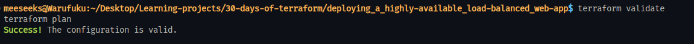

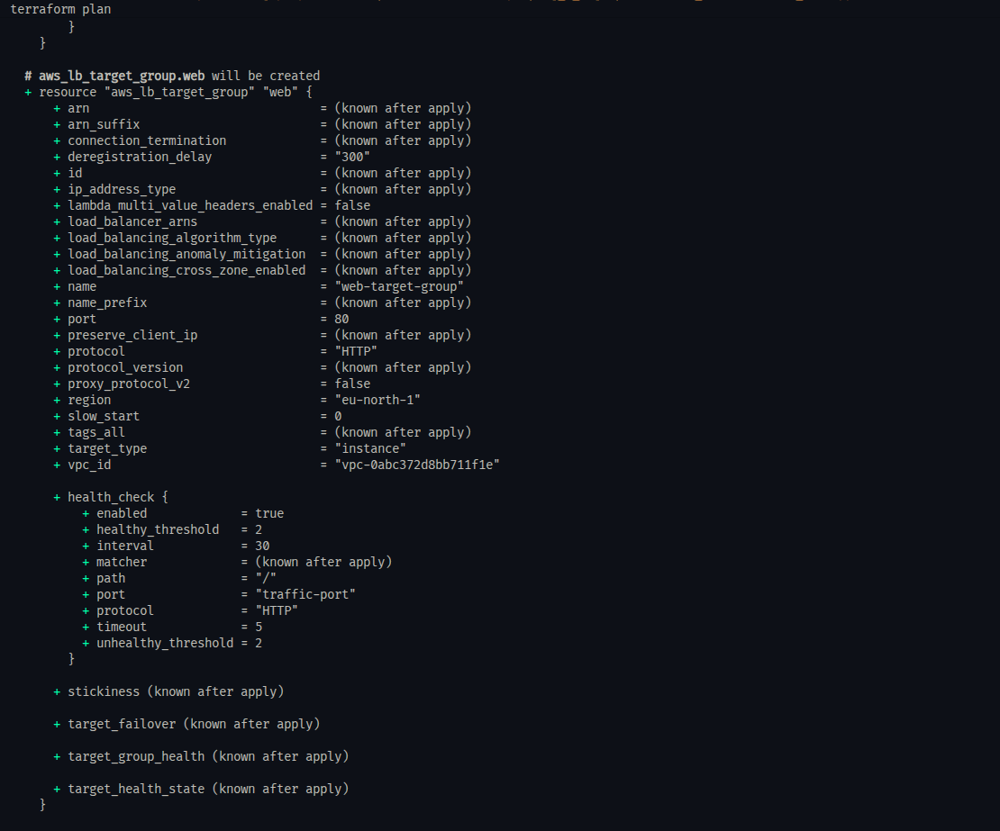

Outcome:

- Terraform configuration is valid
- Target Group is successfully created
- Health checks are configured to monitor instance availability
- The foundation for load balancing is now in place

### Attach ASG to Target Group

I connected the Auto Scaling Group to the Target Group so that instances can receive traffic from the load balancer.

```hcl
resource "aws_autoscaling_group" "web" {
  name                = "web-asg"
  min_size            = 2
  max_size            = 5
  desired_capacity    = 2
  vpc_zone_identifier = data.aws_subnets.default.ids

  target_group_arns = [aws_lb_target_group.web.arn]

  launch_template {
    id      = aws_launch_template.web.id
    version = "$Latest"
  }

  tag {
    key                 = "Name"
    value               = var.server_name
    propagate_at_launch = true
  }
}
```

I validated and planned the configuration:

```bash
  terraform validate
  terraform plan
```


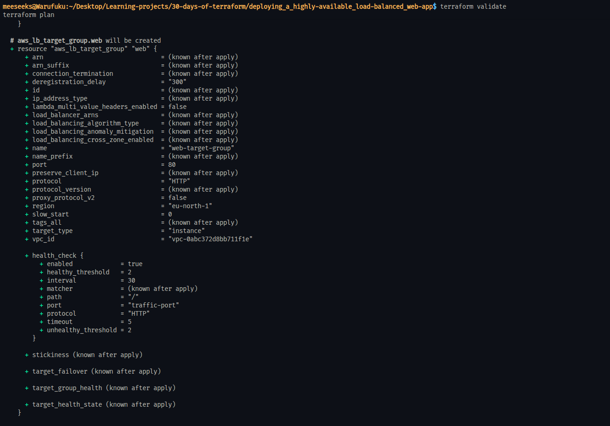

Outcome:

- Terraform configuration is valid
- Auto Scaling Group is now linked to the Target Group
- Instances launched by the ASG will automatically register with the Target Group
- Traffic routing is now prepared for load balancing

### Create Application Load Balancer

I created an Application Load Balancer (ALB) to distribute incoming traffic across multiple instances in the Auto Scaling Group.

```hcl
resource "aws_lb" "web" {
  name               = "web-alb"
  internal           = false
  load_balancer_type = "application"
  subnets            = data.aws_subnets.default.ids

  security_groups = [aws_security_group.web_sg.id]
}
```
I validated and planned the configuration:

```bash
  terraform validate
  terraform plan
```


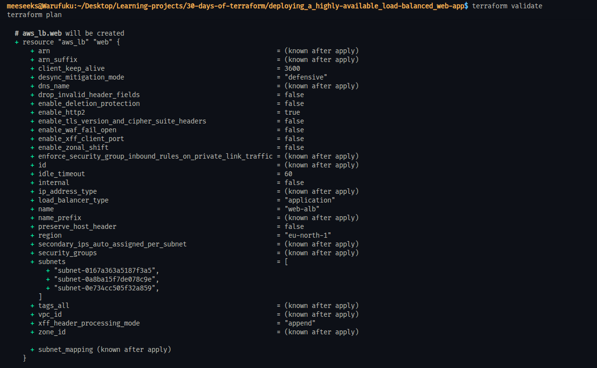

Outcome:

- Terraform configuration is valid
- Application Load Balancer is successfully created
- The ALB is internet-facing and spans multiple subnets
- It is ready to route traffic to the Target Group

### Create Listener

I created a listener to connect the Application Load Balancer to the Target Group.

```hcl
resource "aws_lb_listener" "web" {
  load_balancer_arn = aws_lb.web.arn
  port              = 80
  protocol          = "HTTP"

  default_action {
    type             = "forward"
    target_group_arn = aws_lb_target_group.web.arn
  }
}
```

I validated and planned the configuration:

```bash
  terraform validate
  terraform plan
```

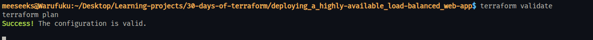

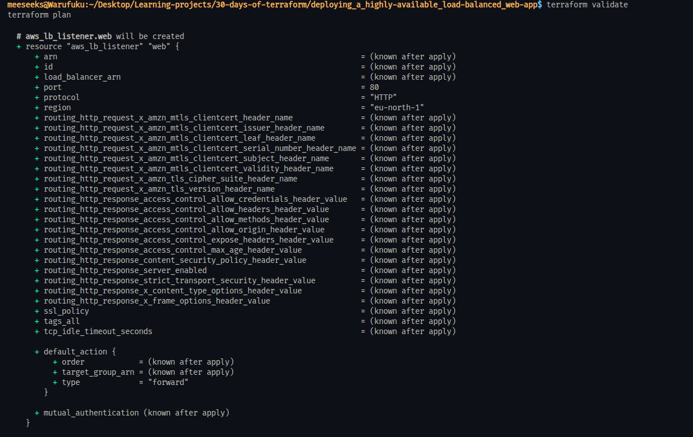

Outcome:

- Terraform configuration is valid
- Listener is successfully created
- Incoming HTTP traffic on port 80 is now forwarded to the Target Group
- The full traffic flow (ALB → Target Group → ASG instances) is now established


### Deploy and verify clustered infrastructure

I deployed the full highly available infrastructure using Terraform.

```bash
  terraform apply
```


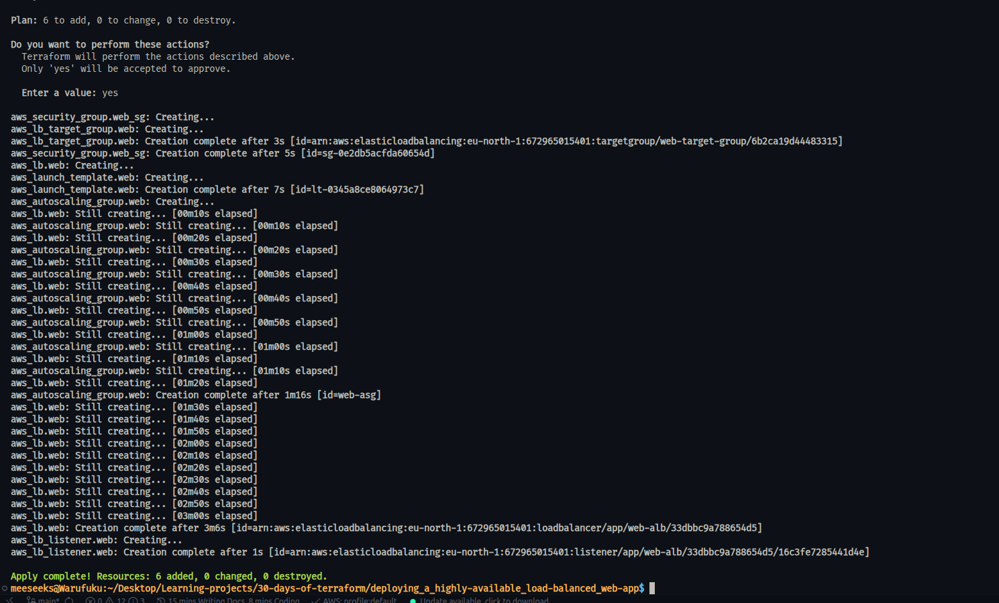
I confirmed the execution by typing:

```bash
  yes
```

After deployment, I retrieved the Application Load Balancer (ALB) DNS name:

```bash
  terraform state show aws_lb.web | grep dns_name
```


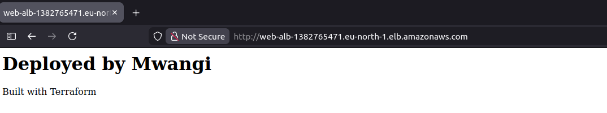

Then I accessed the application in the browser using the ALB DNS.

Outcome:

- Launch Template, Auto Scaling Group, Target Group, Load Balancer, and Listener were successfully created
- Multiple EC2 instances were provisioned automatically by the ASG
- The ALB distributed traffic across the instances
- The web page was successfully accessible via the ALB DNS
- The architecture is now highly available and load balanced instead of a single instance

### Step 21: Clean up clustered infrastructure

After verifying the highly available setup, I destroyed all resources to avoid unnecessary AWS costs.

```bash
terraform destroy
```


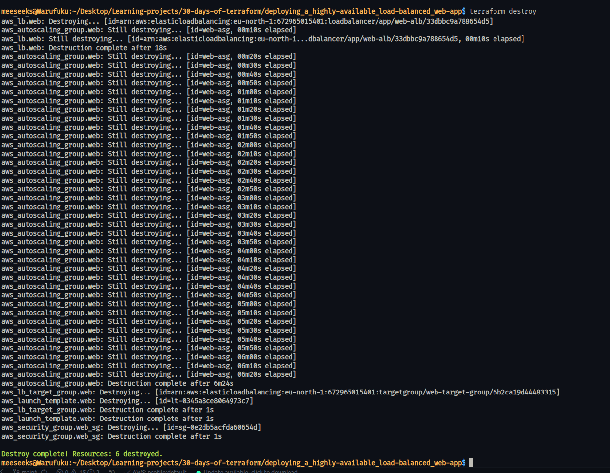

I confirmed the action by typing:

```bash
  yes
```

Outcome:

- Auto Scaling Group was terminated
- Load Balancer and Target Group were deleted
- Launch Template and Security Group were removed
- All EC2 instances were automatically terminated
- Terraform reported:

Destroy complete! Resources destroyed successfully.

- No infrastructure remains running in AWS

# Conclusion

This project covers both configurable infrastructure and highly available architecture using Terraform. I implemented variables, data sources, and a dynamic AMI to eliminate hardcoding and allow runtime flexibility.

 Building on that foundation, I designed a scalable architecture using a Launch Template, Auto Scaling Group, Target Group, and an Application Load Balancer to distribute traffic across multiple instances.
 
The final setup routes traffic from the internet through the load balancer to a target group backed by an auto-scaling fleet of EC2 instances running Nginx, ensuring high availability, scalability, and fault tolerance.