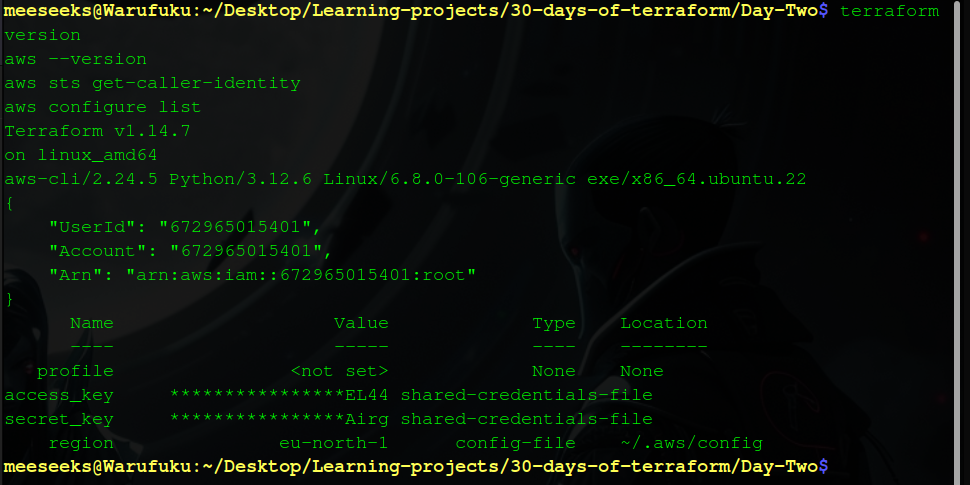
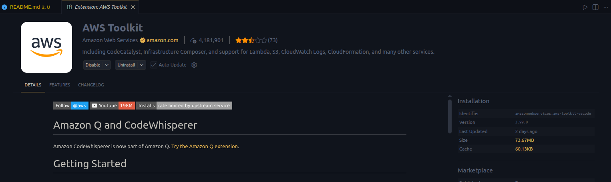
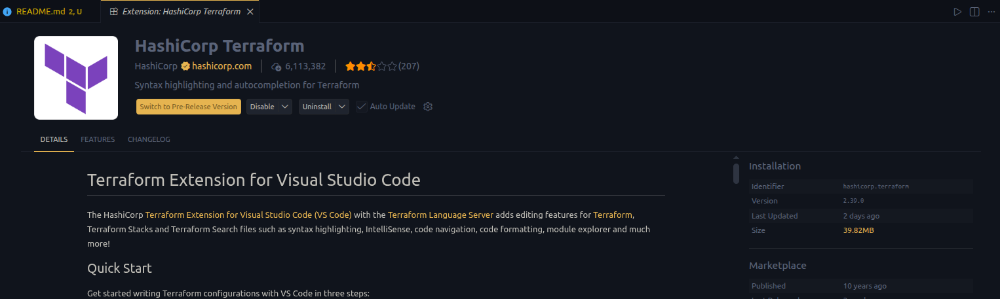

# SETTING UP YOUR TERRAFORM ENVIRONMENT


## Setup Validation

To confirm the environment is fully configured and working, the following commands were executed.

### Terraform Version

```bash
  terraform version
````

```bash
  Terraform v1.14.7
  on linux_amd64
```

### AWS CLI Version

```bash
  aws --version
```

```bash
  aws-cli/2.24.5 Python/3.12.6 Linux/6.8.0-106-generic exe/x86_64.ubuntu.22
```

### AWS Identity Verification

```bash
  aws sts get-caller-identity
```

```json
  {
    "UserId": "672965015401",
    "Account": "672965015401",
    "Arn": "arn:aws:iam::672965015401:root"
  }
```

### AWS Configuration Details

```bash
aws configure list
```

```bash
      Name                    Value             Type    Location
      ----                    -----             ----    --------
   profile                <not set>             None    None
access_key     ****************EL44 shared-credentials-file    
secret_key     ****************Airg shared-credentials-file    
    region                eu-north-1      config-file    ~/.aws/config
```

---

_**Note:**
These outputs confirm that Terraform and AWS CLI are correctly installed and authenticated._




## VS Code Extensions

To improve the development workflow, the following Visual Studio Code extensions were installed:

- **HashiCorp Terraform**
- **AWS Toolkit**

### Installation

- Opened the Extensions tab in VS Code  
- Searched for **HashiCorp Terraform** and installed it  



- Searched for **AWS Toolkit** and installed it  



_**NOTE**: These extensions provide syntax highlighting, autocomplete, and direct interaction with AWS services from the editor._

## Setup Challenges

No issues were encountered during the setup process.

All tools installed and configured successfully, and validation commands returned the expected output.


## Chapter 2 Learnings

Terraform authenticates with AWS using credentials configured through the AWS CLI. When `aws configure` is run, the access key and secret key are stored locally, and Terraform automatically uses these credentials to interact with AWS services.

Using an IAM user instead of the root account is important for security and control. IAM allows you to apply the principle of least privilege by granting only the permissions needed. It also reduces the risk of exposing full account access and makes it easier to manage multiple users without relying on a single root account, which could lead to destructive actions if misused.


## Blog Post

[Read here](https://medium.com/@mwangi8kevin/step-by-step-guide-to-setting-up-terraform-aws-cli-and-your-aws-environment-47f8538b6d7c)

This blog post provides a step-by-step guide on setting up Terraform, installing and configuring the AWS CLI, creating an IAM user, and preparing a development environment for working with Infrastructure as Code on AWS.
